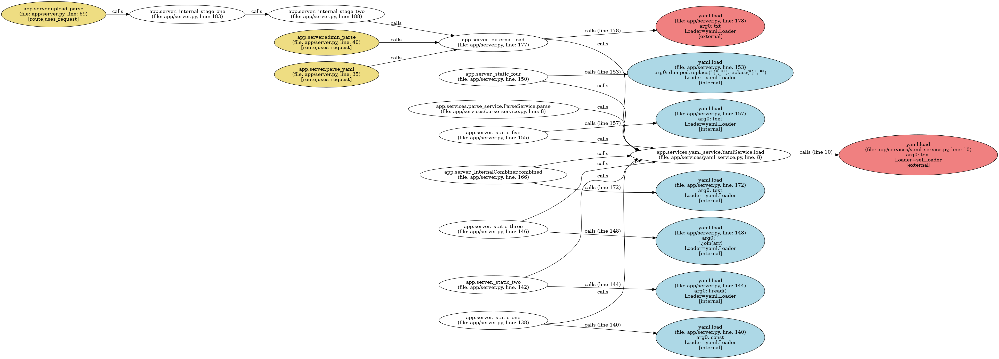

# LXC‑Threat‑API‑Mapping Toolkit

End‑to‑end pipeline for discovering vulnerable API calls in your Python
codebase and ranking them by real‑world exploitability.

```
SBOM / CVE list ─▶ nvd_api_extractor ─┐
                                     ▼
                           risk_db.json (EPSS · KEV · PoC links)
                                     │
                   (optional) ────────┤
                   │                  ▼
                   │        llm_api_enricher / vertex_api_enricher
                   ▼                  │  (fill missing `apis` via LLM)
          risk_enricher (EPSS/KEV)    │
                   ▼                  ▼
          risk_db_enriched.json  ─────────▶ threat_api_mapper
                                            ▲
                                            │  scans your source tree
                                            ▼
                                   threat_map.json
```

<br>


### Requirements (minimum)

```
requests
nvdlib
pandas
openai            # ← if you’ll use llm_api_enricher.py
vertexai          # ← if you’ll use vertex_api_enricher.py
unidiff           # diff parsing for cve_api_extract.py
```

Store cloud creds as env vars:

* **OpenAI** → `OPENAI_API_KEY`
* **Vertex AI** → `GOOGLE_CLOUD_PROJECT`, `GOOGLE_APPLICATION_CREDENTIALS`, `VERTEX_LOCATION`

<br>

## 1 . Generate risk\_db.json

```bash
# Option A – direct CVE list
python nvd_api_extractor.py \
       --cve CVE-2020-14343 CVE-2024-21591 \
       --out risk_db.json

# Option B – CycloneDX SBOM
python nvd_api_extractor.py --sbom bom.json --out risk_db.json
```

Fields populated:

* `cve`, `packages`, `apis` (regex),
* CVSS + `severity`,
* **`epss`, `epssPercentile`**, **`kev`**, optional `exploitDB`.

<br>

## 2 . (Option) Fill missing `apis` via LLM

### OpenAI

```bash
export OPENAI_API_KEY=sk-…
python llm_api_enricher.py risk_db.json --out risk_db_llm.json --model gpt-4o
```

### Google Vertex AI

```bash
export GOOGLE_CLOUD_PROJECT="my‑proj"
export GOOGLE_APPLICATION_CREDENTIALS="/path/key.json"
pip install google-cloud-aiplatform google-generativeai
python vertex_api_enricher.py risk_db.json --out risk_db_vertex.json --model gemini-1.0-pro
```
<br>

## 3 . Map vulnerable API calls in source

```bash
python threat_api_mapper.py \
       --code ./src \                 # root of your codebase
       --risk risk_db_vertex.json \    # or risk_db_llm.json / risk_db.json
       --out threat_map.json \
       --min-epss 0.7      \          # filter (optional)
       --kev-only           \          # CISA KEV only (optional)
       --debug
```

Output `threat_map.json` example:

```json
{
  "file": "app/server.py",
  "line": 42,
  "api": "yaml.load",
  "cve": ["CVE-2020-14343"],
  "severity": "CRITICAL",
  "epss": 0.70,
  "kev": true,
  "exploitDB": "https://www.exploit-db.com/exploits/50291",
  "snippet": "data = yaml.load(user_input, Loader=yaml.Loader)"
}
```

Use this JSON to build dashboards, generate CTI reports, or feed CI gates.
<br>

## 4 . Ad‑hoc utilities

### Extract API names for a single CVE

```bash
python cve_api_extract.py CVE-2020-14343 --debug
```

### Visualize call‑flow graph for a dangerous API

`astvisualizer.py` crawls your project, builds a call graph and highlights
calls to a target function (default `yaml.load`). It renders a **GraphViz**
PNG so you can see how tainted data reaches the vulnerable sink.

```bash
python astvisualizer.py ./src/ --target yaml.load -o callflow_yaml
# ⇒ callflow_yaml.png
```


### Enrich existing DB with EPSS·KEV

```bash
python risk_enricher.py risk_db.json --out risk_db_enriched.json
```
