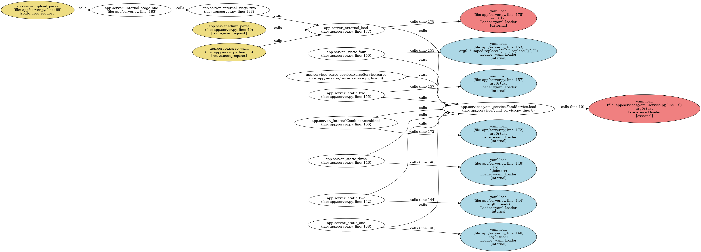

# Python AST Visualizer

A command-line tool to analyze Python code, generate a call-graph diagram, and report on API usage.

---

## Requirements

- Python 3.6+  
- [Graphviz](https://graphviz.org/) (command-line)
- Python packages:
  ```bash
  pip install graphviz
  ```

---

## Usage

```bash
python main.py <path> [options]
```

- `<path>`  
  A Python file or directory to analyze.

### Options

- `-o, --output <prefix>`  
  Output filename prefix for the generated PNG graph.  
  Default: `callflow`

- `-t, --target <module.func>`  
  One or more target API names to highlight in the graph (e.g. `-t yaml.load`).  
  If omitted, all detected API usages are processed and `--force` behavior is applied.

---

## What it does

1. **Scans** the given path (file or directory) for `.py` files.  
   - Logs:  
     ```
     [INFO] Collected <N> Python files for analysis
     ```  
     or  
     ```
     [INFO] Single file mode: <file>
     ```
2. **Parses** each file and builds a call graph using `utils.ast_to_png`.  
3. **Renders** the call graph as `<prefix>.png`.  
4. **Prints** three API lists to the console:
   ```
   Externally exposed APIs:
     <api1>
     <api2>
   
   Internally only APIs:
     <api3>
     …
   
   Unused APIs:
     <api4>
     …
   ```

---

## Example

```bash
python main.py ./src -t yaml.load -t requests.get -o api_graph
```

### output

```bash
[INFO] Collected 14 Python files for analysis
[INFO] Starting analysis on 14 files in test_target
[INFO] Graph saved to api_graph.png
Externally exposed APIs:
  yaml.load

Internally only APIs:

Unused APIs:
  request.get
```
- Generates `api_graph.png`  
- Prints lists of external, internal-only, and unused APIs to the console.

---
